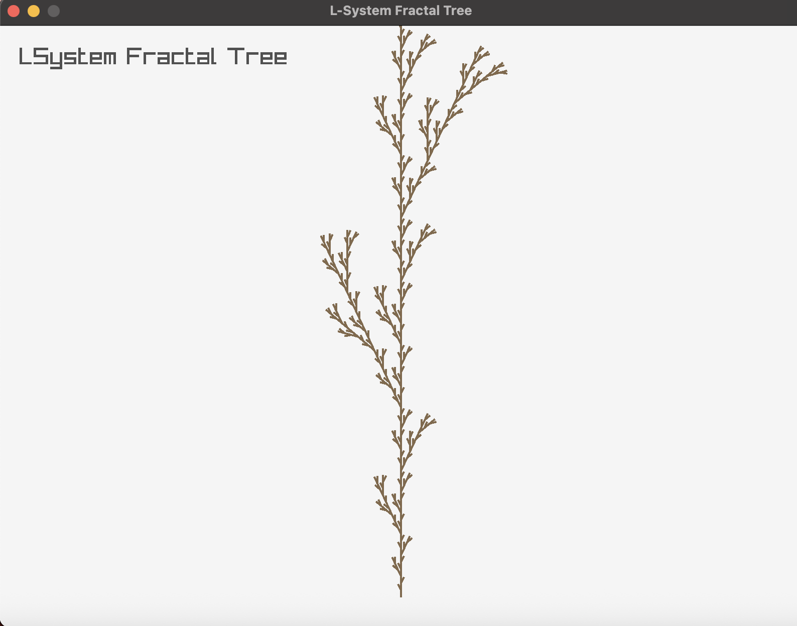

## Overview
- small LSystem fractal tree implementation &rarr; follow up for my normal fractal tree implementation.
- I used C style C++ Syntax for practacing it & since Numeric Recipes uses this paradigma

> Screenshot from the simulation

### Resources
[Coding Train LSystem Fractal Trees](https://www.youtube.com/watch?v=E1B4UoSQMFw)
[Numeric Recipes](https://faculty.kfupm.edu.sa/phys/aanaqvi/Numerical%20Recipes-The%20Art%20of%20Scientific%20Computing%203rd%20Edition%20(Press%20et%20al).pdf)
